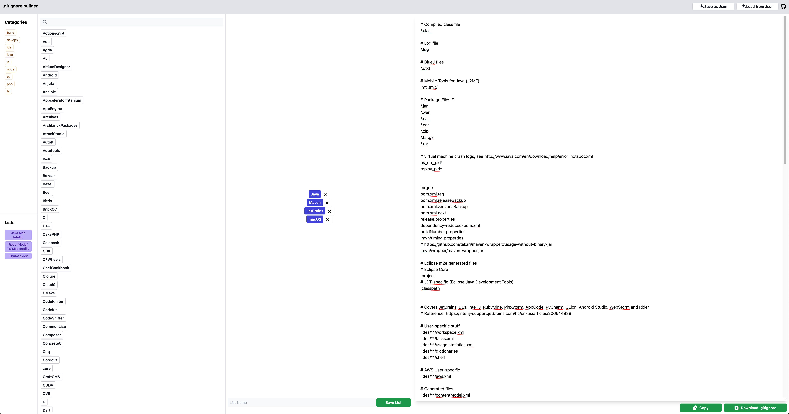

# .gitignore Builder UI

A simple app to create .gitignore files

**Demo** https://alexadam.github.io/demos/gitignore-builder/index.html

Data source: https://github.com/github/gitignore



## Features

- Filter by tags & name 
- Create custom lists of .gitignore files
- Export / import as JSON
- [TODO] Edit tags from the UI

## How to run

Download or clone this project with `git clone`, open a terminal, go to the project's folder and run:

```shell
npm install
npm run dev
```

Then, open the link in a web browser (usually it's http://localhost:5173/)
